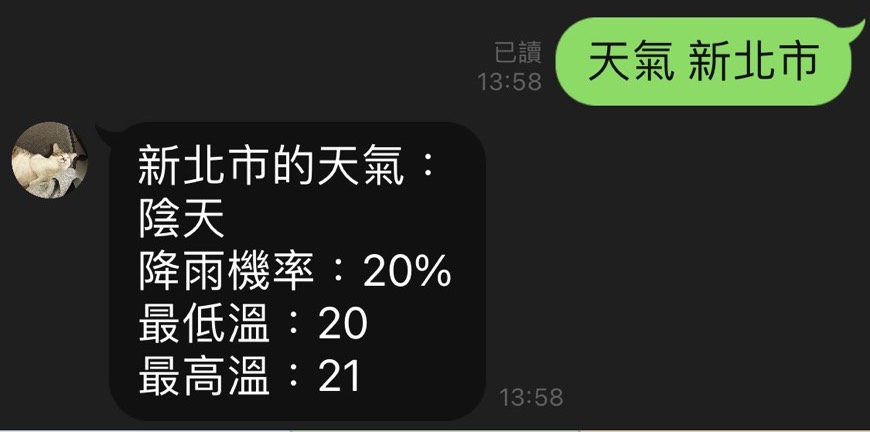
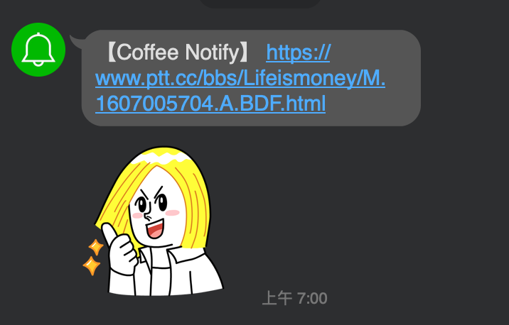
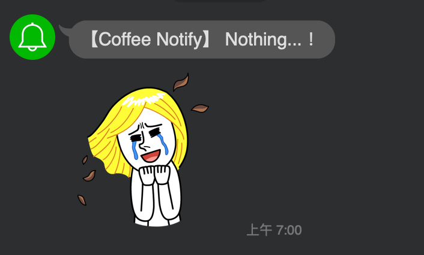

# 哈哈雷聊天機器人: `天氣` & `PTT` 
## QR code

## 預設

#### 成功將 哈哈雷 加為好友，你/妳會先被兇一波 ...

#### 哈哈雷 共有 3 個選項（ RichMenu）可以點擊

## 功能介紹
#### 一、查詢台灣各縣市天氣資訊  
- 點擊最左邊的選單，會自動出現 “我要查天氣～”

    
    
- 哈哈雷會自動回傳: 台灣北、中、南、東區以及離島之各縣市（ flexMessage ）

- 假設點擊 “新北市”， 哈哈雷會回傳：

#### 二、爬特定 PTT 版，並回傳文章標題
- 特定版：`Gossiping`、 `Beauty`、 `iOS`、 `NBA`、 `Lifeismoney`、 `Tech_Job`、 `movie`、 `PlayStation`

- 點擊最右邊的選單，會自動出現 "我要看PTT～"

    

- 哈哈雷會問你/妳想看什麼版

    

- 假設點擊 “Lifeismoney版”，哈哈雷會耐心的詢問要看前幾頁～

    

- 選擇 "前2頁"， 哈哈雷會回傳文章標題（超連結），而且會依據推文數改變標題顏色喔！

    

#### 三、每日 7 點，通知是否有 `關於咖啡的優惠`
- 礙於 Line Bot 主動發訊息有流量限制，所以結合 `Line Notify` 。
- 每天早上 7 點，爬“Lifeismoney版”。
    - 若標題含有“咖啡” 且 發文時間為昨日。則：

        

    - 否則：

        

## 趁機打個廣告
#### 哈哈雷有出貼圖喔！如有興趣，可以前往以下連結逛逛～

- [我是哈雷不是哈登](https://store.line.me/stickershop/product/12319569/zh-Hant)

- [我是哈雷不是哈登 2 米哥一起過聖誕](https://store.line.me/stickershop/product/13745533/zh-Hant?from=sticker)

